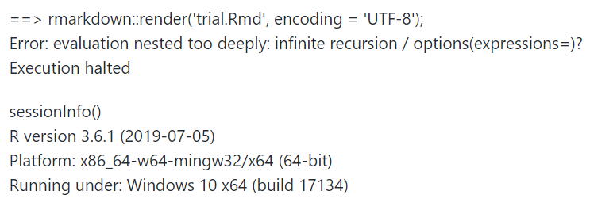
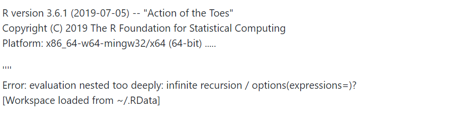

```{r setup, include=FALSE}
knitr::opts_chunk$set(echo = FALSE)
```

I was getting errors knitting .Rmarkdown or .Rmd files and the culprint was that I had multiple .Rprofiles in my Home and project directories. The error is as shown below




Everytime I restarted the machine it was loading the previous workspace with the following error. 



At first I thought .RData was the culprint and I unliked it using unlink("~/.RData"). It still did not solve the problem.

I had updated to the latest Rversion and my first instinct was update libraries, uninstall and reinstall R+Rstudio but still the error was there anytime I tried knitting. I tried most suggestions provided such as including self_contained: no and even installed tinytex : tinytex::install_tinytex(). 


## Solution

> The following solution was provided by Yihue Xie.

First, I had to uncheck the Restore workspace in the Global settings as show below and checked if the project directory had any .Rprofile and set it according to this  [link](https://bookdown.org/yihui/blogdown/global-options.html). 


The following are some great resources that helped me

1. [R setup](https://csgillespie.github.io/efficientR/3-3-r-startup.html) 
2. [Startup - Rprofile ](https://whattheyforgot.org/r-startup.html#rprofile)

Finally, I can run my files without any hustle. Thanks to the support of Yihue Xhie and Christopher Dervieux. They helped me figure out where the problem was.


> If you'd like to refer to the conversation, I lodged an issue to the Rstudio community and Github [here](https://github.com/rstudio/rmarkdown/issues/1621).

