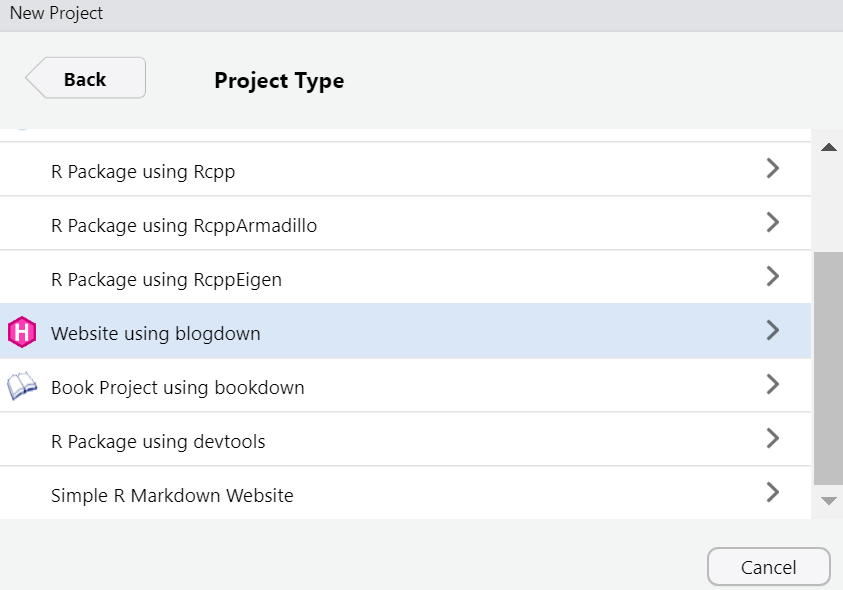
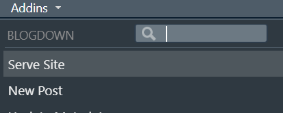
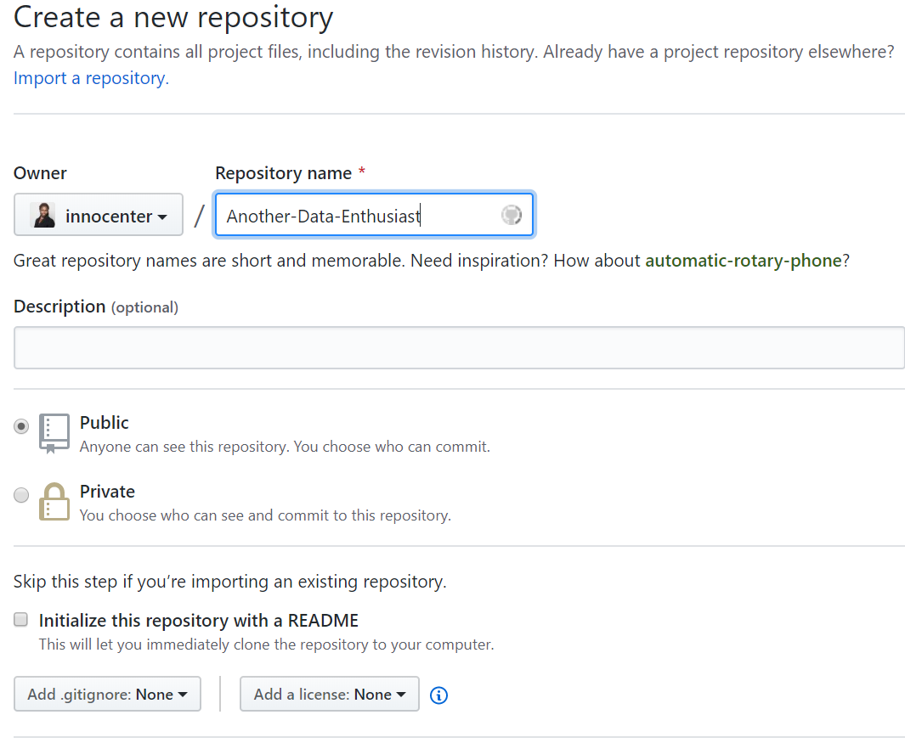
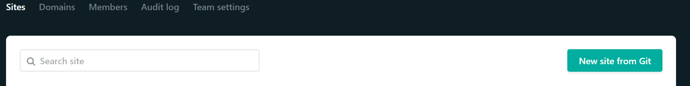
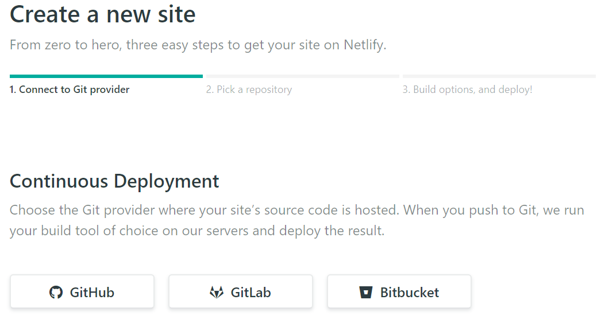
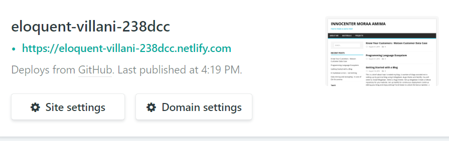

```{r setup, include=FALSE}
knitr::opts_chunk$set(echo = FALSE)

```


I have been creating this blog in my mind for months and hey I finally did it!

Below I will show you how I set up my personal blog using R Blogdown, Hugo, Github and Netlify. I will continuously update and improve it. Comments or suggestions on how to improve it are welcome :-)


To begin with, you will need the following to set up your blog 

>1. Install Blogdown.
2. Select a Hugo theme.
3. Set up blogdown 
4. Create a Github repository for your website.
5. Set up Netlify for continuous deployment
6. Continue editing your blog and enjoy writing!!

Scroll down to unlock the bonus tip/idea :-) 


## 1. Installing Blogdown

Install blogdown in R studio from  CRAN ` install.packages("blogdown") `

Or, install from GitHub

```if (!requireNamespace("devtools")) install.packages("devtools")
devtools::install_github("rstudio/blogdown")```


[More here : blogdown installation](https://bookdown.org/yihui/blogdown/installation.html)

## 2. Selecting a Hugo Theme


Hugo is a lightweight engine that can be used to create static websites. Hugo uses `Go` library for its template engine. You will be required to select a theme, here is the [complete list](https://themes.gohugo.io/). More on setting up Hugo themes [here](https://bookdown.org/yihui/blogdown/themes.html).


## 3. Set up Blogdown 

After selecting the Hugo theme, using R studio open a new project and directory:  using File → New Project → New Directory → Website using Blogdown



# ```{r}
# 
# ```


You will be required to specify the directory name of the blog, the subdirectory where the blog is going to be place and the theme you selected in step 2 above. Complete the set up by clicking create project. More on blogdown Rstudio IDE [here](https://bookdown.org/yihui/blogdown/rstudio-ide.html). You can modify the config.toml file, create new posts...

The website created can be built interactively by using ```blogdown::serve_site()``` or clicking Addins as shown




Now you can create a New Post by clicking `New Post` using the Addins or `new_post(title = 'xxx.md')` for markdown post or `new_post(title = 'xxxx.Rmd')` for R markdown files. 


### Blogdown Structure

Depending on the theme selected, kindly note

>1. `Static` folder :  is the root folder for the new blog. This is a perfect place to include the images folder or pdf/materials folder.
2. `Public` folder : after building the website - the final rendered static HTML files and structure are stored here. This is the folder that shall be uploaded to Github.
3. `Theme` folder : all the formating for the Hugo theme you selected are stored here.
4. `Content` folder : is the folder containing all the posts you will create. Usually has some markdown or .Rmd from the example site.

## 4. Deployment with Github

Log into Github and create a new repository - do not add a readme.md yet. I prefer this way so that I do not have to make a `git pull` request.





Push the existing website located in your local directory to the repository using the command line as shown below - note to change the working directory to public/ before initializing the GIT repository `cd ../public`. I noticed if the whole working directory is put on Github - you will be required to add a `netlify.toml` file - not sure if it was the theme I was using back then or it is universal. Best practise is to upload `public` folder since it contains the rendered HTML files of your website. 

After changing to `../public` folder where the HTML files are rendered do;


1. `git init` : _to initialize the local directory/repository_ 

2. `git remote add origin https://github.com/username/repositoryname.git` _for example https://github.com/innocenter/Another-Data-Enthusist.git_ 

3. `git push -u origin master`

Now you can add a readme.md note. You will be required to pull(fetch and merge) the files if you add any file using Github online. Safe to update in local directory using `git add readme` then `git commit -m "read me"`.


> Although Github supports only Jekyly and not Hugo, you can publish static HTML pages. Reference the following [link](https://bookdown.org/yihui/blogdown/github-pages.html)


## 5. Continous deployment with Netlify

Now worry not about having to upload the _public_ folder to  [Netlify](https://www.netlify.com) everytime. Connect the Github repository and let Netlify continously deploy your website anytime you update. 

Another route will be to skip Github but everytime you will have to upload the public folder to Netlify.

Log in to Netlify create a new site using Github




Select Github and follow the steps to deploy the website - netlify will turn to green if the deployment was a success.



You can edit the setting of your website name




Now you are ready to role - update Github by adding any new files and committing the changes. Now you have a domain name `website.netlify.com`- remember to edit the config.toml baseurl which was set with a trailing backslash `baseurl = "/"`. Copy the name of the website and replace it as `baseurl = "https://name-of-website.netlify.com"` This is why

> The only purpose for the baseurl field in the config is to define the full base URL of your website for deployment purposes.” - @rdwatters

_And the bonus is!!!!_

## Adding comment section using Disquis

You can include comments in your new webiste. Yay!! Follow the following reference [How to install disqus on hugo](https://notes.peter-baumgartner.net/tutorial/how-to-install-disqus-on-hugo/) that provides clear way to setup.


### Working on a post and prefer to upload later?
 
 No problem, if it is a markdown file, you can either 

1. Create the content with a future or past `publishDate` value for example date : "2019-08-01" and publishDate: '2020-03-04'

2. Create content with draft: true status


### Other useful resources for setting up a blog

Creating a website can be messy.  You will actually get a lot of errors - The following resources might be useful. The helped me a lot. 

 

+ [Creating the blog](http://estebanmoro.org/post/2019-02-02-setting-up-your-blog-with-rstudio-and-blogdown-i-creating-the-blog/)
  
+ [Blogdown book](https://bookdown.org/yihui/blogdown/) by Yihui Xie, Amber Thomas, Alison Presmanes Hill

+ [Blogdown and Hugo ](https://www.tylerclavelle.com/code/2017/blogdown/)
  
+  Change the baseurl after getting a domain name. [More here](https://alison.rbind.io/post/2019-03-04-hugo-troubleshooting/)
+ Long live Netlifly! [here](https://yihui.name/en/2017/06/netlify-instead-of-github-pages/)


Happy blogging :-)  


Feel free to drop a comment or suggestion in the comment section.


Update: I have moved my site from using blogdown to distil. Here is a great reference if planning to use [distil](https://www.shamindras.com/posts/2019-07-11-shrotriya2019distillpt1/). 
